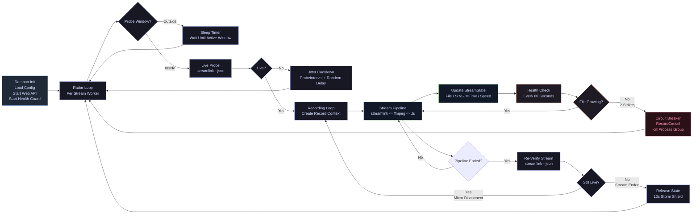

## 🛠️ 快速操作手冊

**1. 啟動與修改設定**
```bash
# 1. 打造一個全新的工具箱 (建立新的 venv)
python3 -m venv venv

# 2. 打開工具箱
source venv/bin/activate

# 3. 把 streamlink 這個工具裝進去
pip install streamlink

# 4. 把工具箱關起來 (裝完就好了)
deactivate

# 5. build
go build -ldflags="-s -w" -o livetool .


## 核心指令
./launcher.sh start   # 啟動系統 (清空舊進程，將雷達與 Web 丟入背景)
./launcher.sh status  # 打開動態監控儀表板 (按 Ctrl+C 退出面板，不影響背景錄影)
./launcher.sh stop    # 優雅關閉 (發送 pkill 清空所有相關進程，不留殭屍)
./launcher.sh log     # 選擇查看不同組件的系統日誌
```
